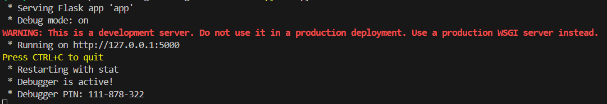

# Maple Frog Studio - Hobby Trader Package 
>**Warning**  
>Work in progress, not production ready, poor documentation :)  

Demo of using Tradingview's lightweight charts implemented in a Flask web project. 
Using Hard coded json data defined in routes.py file.  

## Installation  
Open a powershell console and type:
```  
> python --version  
> git clone https://github.com/MapleFrogStudio/tradingviewwithflask.git
> cd tradingviewwithflask
> python -m venv env
> .\env\Scripts\Activate  
> python -m pip install --upgrade pip
> pip install -r requirements.txt
```

## Running Demo  
In the same Powershell console type:
> py run.py  

You will see a message similar to this  

  
CTRL-Click on the http://127.0.0.1:5000 to open the default page in your web browser. Follow the link to see a hard coded chart!
